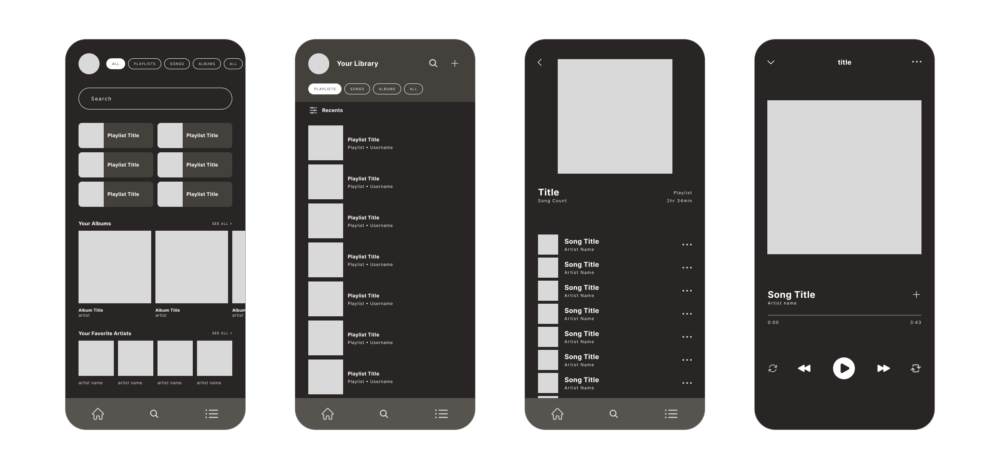
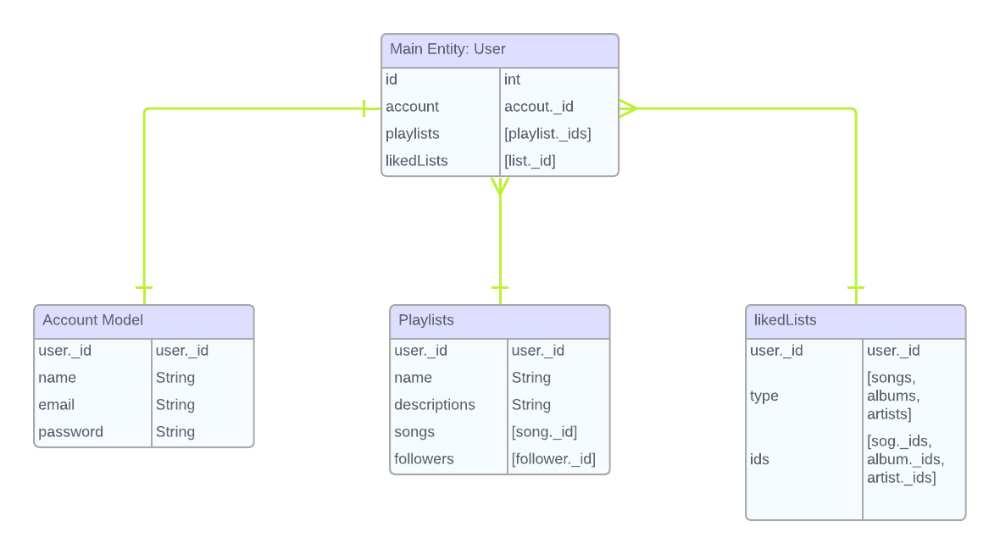
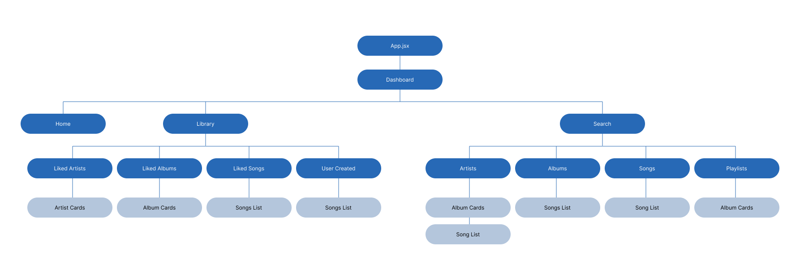

# Spotify Clone
I use Spotify all day, every day and have been for decades it feels. I wanted to recreate Spotify, but with my design vision and customized to how I would want to curate playlist and collaboration lists. Spotify has a lovely UI system already, so this is my Spotify Reimagined. 

### Technology Used 
--- 
React 
  
Vite 
  
Tailwind
  
Javascript
  
Express
  
MongoDB
 

### Wireframes
---

### ERD Model
---

### Component Hierarchy
---

### Getting Started 
---
View the deployed version here (link available soon)

